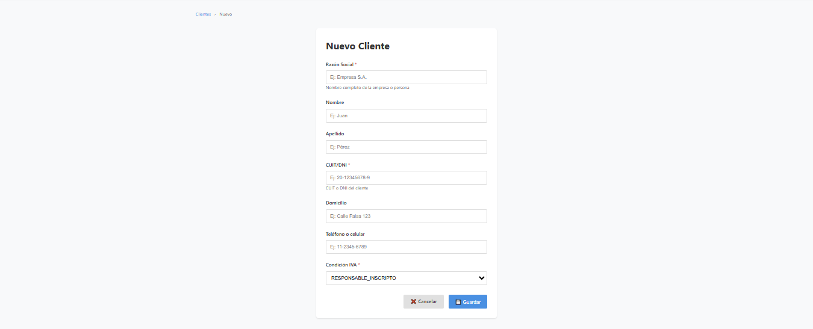
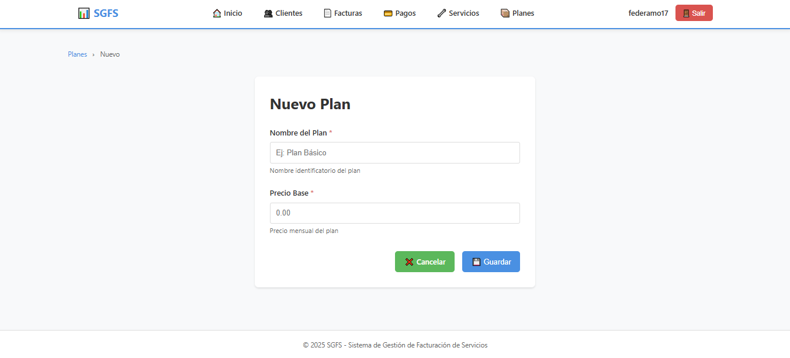
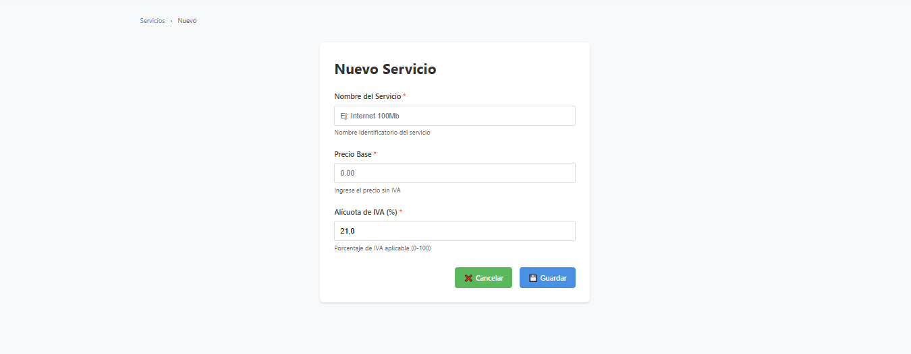

# Documento de Diseño y Planificación - Iteración 1

# Trabajo en equipo
* **Martin** Configuración inicial del repositorio y estructura de carpetas.
* **Gabriel:** Diseño del Modelo de Entidad-Relación y configuración de JPA.
* **Federico:** Desarrollo de los ABM de Clientes y Servicios.

# Diseño OO

# Wireframe y caso de uso

## Caso de Uso: Alta de Cliente
1.  El usuario navega a la sección "Clientes".
2.  Hace clic en "Nuevo Cliente".
3.  El sistema despliega un formulario solicitando: Razón Social, Nombre, Apellido, CUIT/DNI, Domicilio, Teléfono, Condición IVA.
4.  El usuario ingresa los datos y confirma.
5.  El sistema valida los datos, crea automáticamente la cuenta del cliente y guarda.

## Caso de Uso: Alta de Plan
1.  El usuario navega a la sección "Planes".
2.  Hace clic en "Nuevo Plan".
3.  El sistema despliega un formulario solicitando: Nombre del Plan, Precio Mensual.
4.  El usuario ingresa los datos y confirma.
5.  El sistema valida y guarda el plan.

## Caso de Uso: Alta de Servicio
1.  El usuario navega a la sección "Servicios".
2.  Hace clic en "Nuevo Servicio".
3.  El sistema despliega un formulario solicitando: Nombre del Servicio, Precio Base, Alicuota de IVA.
4.  El usuario ingresa los datos y confirma.
5.  El sistema valida y guarda el servicio.

# Backlog de iteración
* **HU 1.1:** ABM de Clientes.
* **HU 1.2:** Gestión de Servicios y Planes.
* **HU 2.2:** Conexión a Base de Datos.

# Tareas
* Inicializar proyecto Spring Boot.
* Configurar `application.properties` para PostgreSQL.
* Crear Entidades `Cliente`, `Servicio`, `Plan`.
* Crear Repositorios y Servicios correspondientes.
* Crear Controladores y Vistas Thymeleaf para los ABMs.