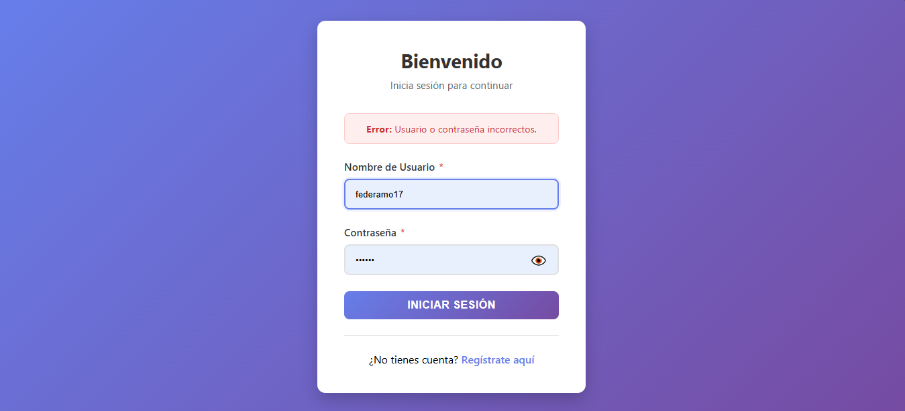
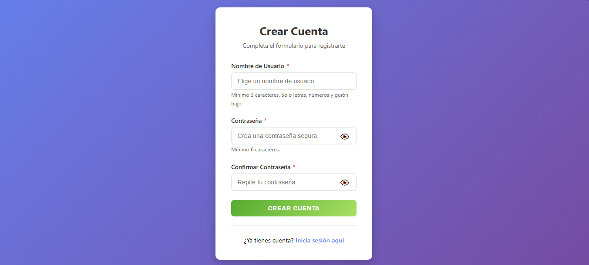
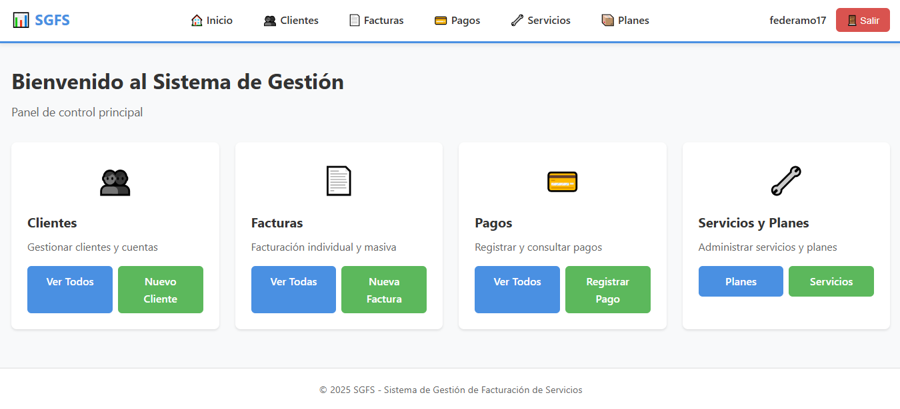
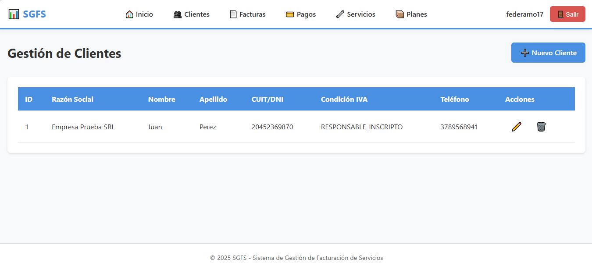
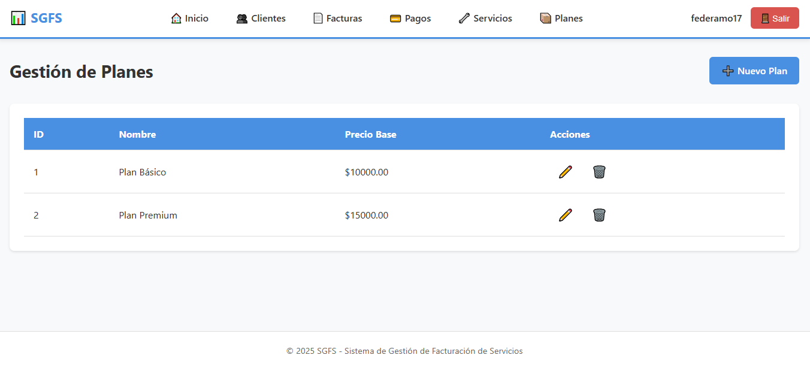

# Documento de Diseño y Planificación - Iteración 2

# Trabajo en equipo
* **Federico:** Implementación de Spring Security (Login, Logout, Encriptación de claves) y mejoras en el ABM de Clientes.
* **Gabriel:** Desarrollo de entidades del modelo de negocio para Facturación y Pagos (Backend).
* **Martin:** Integración de vistas, mejoras en layout Thymeleaf y pruebas del sistema.

# Diseño OO

# Wireframe y caso de uso

## Caso de Uso: Login
1.  El usuario accede a la aplicación.
2.  El sistema detecta que no está autenticado y lo redirige a `/login`.
3.  El usuario ingresa nombre de usuario y contraseña.
4.  El sistema valida las credenciales usando Spring Security.
5.  Si son correctas, redirige al Dashboard; si no, muestra mensaje de error.

## Caso de Uso: Registro de Usuario
1.  El usuario accede a la página de registro.
2.  El sistema muestra un formulario solicitando: Nombre de usuario, Email, Contraseña, Confirmar contraseña.
3.  El usuario ingresa los datos y confirma.
4.  El sistema valida que el nombre de usuario no exista, encripta la contraseña y guarda el usuario.
5.  Redirige al login para que el usuario inicie sesión.

## Caso de Uso: Dashboard Principal
1.  El usuario autenticado accede al sistema.
2.  El sistema muestra el dashboard con el menú de navegación.
3.  El usuario puede acceder a las secciones: Clientes, Planes, Servicios.
4.  El dashboard muestra información resumida del sistema.

## Caso de Uso: Gestión de Clientes (Ampliado)
1.  El usuario navega a la sección "Clientes".
2.  El sistema muestra la lista de clientes con: ID, Razón Social, Nombre, Apellido, CUIT/DNI, Condición IVA, Teléfono.
3.  El usuario puede crear, editar o eliminar clientes.
4.  Al crear/editar un cliente, el sistema crea automáticamente una CuentaCliente asociada con estado ACTIVA.
5.  El sistema valida que el CUIT/DNI sea único antes de guardar.

## Caso de Uso: Gestión de Planes (Ampliado)
1.  El usuario navega a la sección "Planes".
2.  El sistema muestra la lista de planes con: ID, Nombre, Precio.
3.  El usuario puede crear, editar o eliminar planes.
4.  Al crear/editar un plan, el sistema muestra un formulario solicitando: Nombre del Plan y Precio Mensual.
5.  El sistema valida los datos y guarda el plan.

## Caso de Uso: Gestión de Servicios (Ampliado)
1.  El usuario navega a la sección "Servicios".
2.  El sistema muestra la lista de servicios con: ID, Nombre, Precio Base, Alícuota IVA.
3.  El usuario puede crear, editar o eliminar servicios.
4.  Al crear/editar un servicio, el sistema muestra un formulario solicitando: Nombre del Servicio, Precio Base y Alícuota de IVA.
5.  El sistema valida los datos y guarda el servicio.

# Backlog de iteración
* **HU 2.1:** Implementación de Spring Security con Login, Logout y Registro de usuarios.
* **HU 1.1 (Ampliada):** Mejoras en ABM de Clientes (creación automática de CuentaCliente).
* **HU 1.2 (Completada):** Gestión completa de Servicios y Planes con ABM funcional y vistas Thymeleaf.
* **HU 1.4:** Definición del modelo de datos completo para Facturación (Factura, DetalleFactura, Pago, ItemPago, NotaCredito, Recibo, ServicioContratado).
* **HU 2.2:** Layout Thymeleaf mejorado con fragmentos CSS modulares y estructura reutilizable.
* **HU 2.3:** Persistencia completa en Base de Datos PostgreSQL con JPA/Hibernate.

# Tareas
* Configurar `SecurityConfig` con autenticación basada en base de datos.
* Implementar `UserDetailsService` personalizado usando entidad `Usuario`.
* Crear controladores `AuthController` para login y registro.
* Desarrollar vistas Thymeleaf para login, registro y dashboard.
* Implementar entidades del modelo de negocio: `Factura`, `DetalleFactura`, `Pago`, `ItemPago`, `NotaCredito`, `Recibo`, `ServicioContratado`.
* Agregar campos `nombre`, `apellido` y `telefono` a la entidad `Cliente`.
* Crear repositorios JPA para todas las nuevas entidades.
* Mejorar estructura de layout con fragmentos CSS modulares (layout.css, planes-lista.css, servicios-lista.css, clientes-lista.css, etc.).
* Implementar lógica de creación automática de `CuentaCliente` al registrar un cliente.
* Validaciones de negocio en servicios (CUIT único, estados de cuenta, etc.).

# Logros de la iteración
* ✅ Sistema de autenticación completo con Spring Security.
* ✅ Encriptación de contraseñas con BCrypt.
* ✅ Modelo de datos completo para facturación y pagos.
* ✅ ABM de Clientes ampliado y funcional con creación automática de cuentas.
* ✅ ABM de Planes y Servicios completamente operativos.
* ✅ Layout Thymeleaf modular con inyección de CSS por fragmentos.
* ✅ Persistencia completa en PostgreSQL de todas las entidades.

# Deuda técnica
* Implementar lógica de facturación masiva y cálculo de totales.
* Desarrollar vistas para gestión de facturas y pagos.
* Implementar reportes y consultas de estado de cuenta.
* Agregar validaciones adicionales en formularios del lado del cliente.